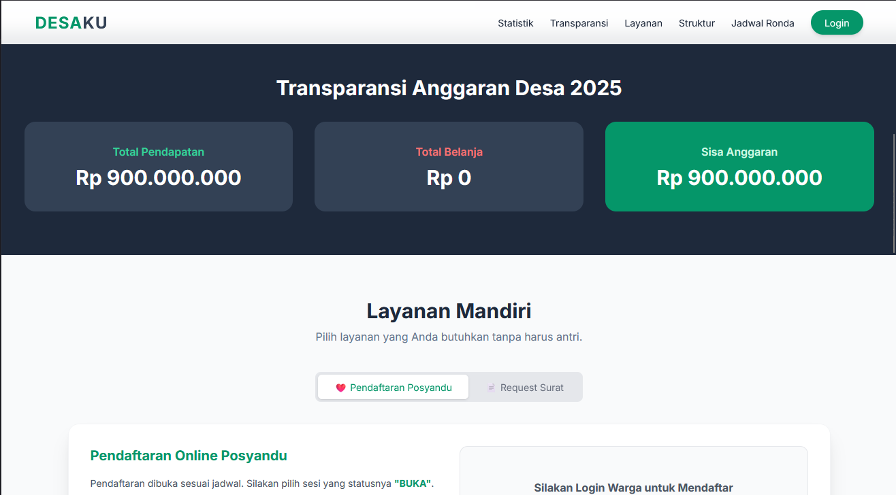
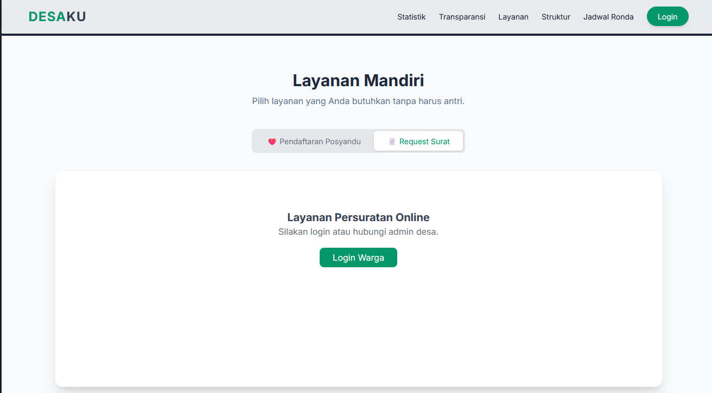
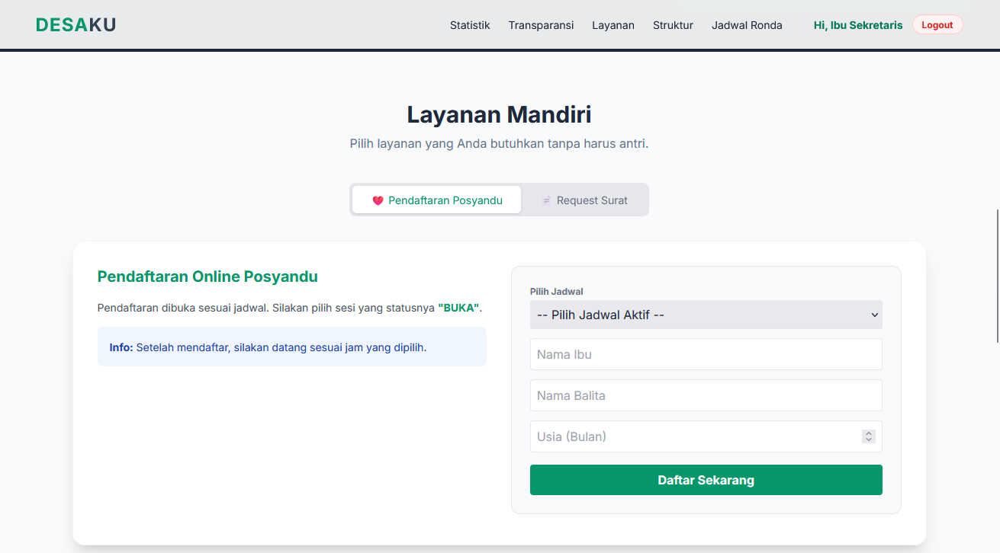
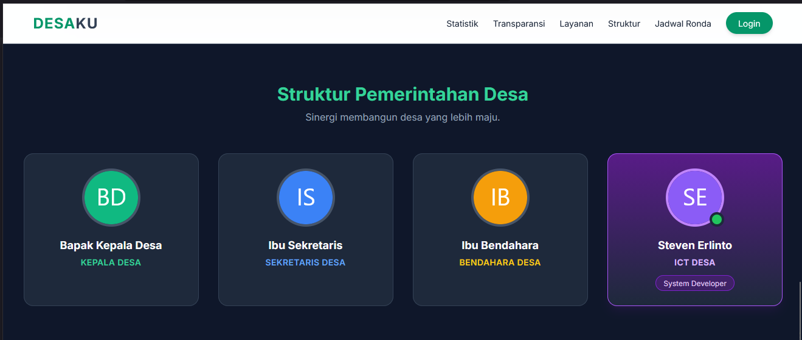

# 🏛️ DESAKU - Sistem Informasi Desa Terpadu


> **Sistem manajemen administrasi dan pelayanan publik desa berbasis web yang modern, transparan, dan terintegrasi.**

---

## 🌟 Tentang Project

**DESAKU** adalah platform digital yang dirancang untuk memodernisasi tata kelola pemerintahan desa. Aplikasi ini memfasilitasi interaksi antara perangkat desa (Kades, Sekdes, Bendahara) dengan warga melalui sistem pelayanan mandiri dan transparansi data.

Dibangun dengan **Native PHP** yang ringan dan desain antarmuka **Clean UI** menggunakan Tailwind CSS, sistem ini dioptimalkan untuk kecepatan dan kemudahan penggunaan.

### ✨ Fitur Utama

* **🔐 Multi-Role Access Control:**
    * **Kepala Desa:** Dashboard Eksklusif dengan Grafik Visual (Chart.js) & Tanda Tangan Digital.
    * **Sekretaris:** Manajemen Penduduk, Berita, Inventaris, Jadwal Ronda & Verifikasi Surat.
    * **Bendahara:** Pencatatan Keuangan APB Desa (Pemasukan/Pengeluaran) & Laporan.
    * **Warga:** Layanan Mandiri (Request Surat Online & Pendaftaran Posyandu).
* **📊 Data Visualization:** Penyajian data demografi dan keuangan dalam bentuk grafik interaktif.
* **⚡ Auto-Account:** Input data penduduk otomatis men-generate akun akses layanan warga (User/Pass: NIK).
* **🏥 E-Posyandu & Ronda:** Manajemen jadwal kegiatan desa secara digital.
* **🛡️ Secure Logic:** Proteksi akses halaman berdasarkan level user (Session & Role Check) dan Password Hashing (Bcrypt).

---

## 🛠️ Teknologi yang Digunakan

* **Backend:** PHP Native (Procedural/Functional).
* **Database:** MySQL / MariaDB.
* **Frontend:** HTML5, Tailwind CSS (CDN).
* **Library:** Chart.js (untuk grafik statistik).
* **Server:** Apache (XAMPP/Hosting).

---

## 📸 Galeri Aplikasi

Berikut adalah tampilan antarmuka (UI) dari Sistem DESAKU.

| **Dashboard Preview Warga** | **APBDesa Preview** |
|:---:|:---:|
|  |  |
| *Monitoring data penduduk secara real-time.* | *Preview Transparansi Keuangan Desa* |

| **E-Administrasi Surat** | **Layanan Posyandu** |
|:---:|:---:|
|  |  |
| *Approval berjenjang (Warga -> Sekdes -> Kades).* | *Manajemen jadwal & pendaftaran kesehatan.* |

| **Dashboard Developer** | **Dashboard Kades** |
|:---:|:---:|
|  |  |
| *Approval berjenjang (Warga -> Sekdes -> Kades).* | *Manajemen jadwal & pendaftaran kesehatan.* |

---

## 🔒 Hak Cipta & Lisensi (Copyright)

**© 2025 Steven Erlinto. All Rights Reserved.**

⚠️ **PERINGATAN KERAS / WARNING:**

Source code ini dipublikasikan di GitHub untuk tujuan **Portofolio** dan **Edukasi Terbatas**.

1.  **DILARANG KERAS** menyalin, menjiplak, atau menggunakan Desain Antarmuka (UI/UX) dari aplikasi ini untuk tujuan komersial atau proyek pribadi tanpa izin tertulis.
2.  **DILARANG** menjual kembali (resell) source code ini dalam bentuk apapun.
3.  Anda diperbolehkan mempelajari logika kodingan (Backend Logic) untuk referensi belajar, namun **Attribution (Kredit)** kepada pembuat asli wajib dicantumkan.

Pelanggaran terhadap hak cipta desain ini akan ditindaklanjuti sesuai ketentuan undang undang Hak Cipta yang berlaku.

---

## ⚙️ Cara Instalasi & Skema Database

Ikuti langkah berikut untuk menjalankan project di komputer lokal (Localhost):

1.  **Clone Repository** atau Download ZIP.
2.  Pindahkan folder ke dalam `htdocs` (jika menggunakan XAMPP).
3.  Buat Database baru di phpMyAdmin dengan nama: `db_desa`.
4.  Import skema database di bawah ini ke menu **SQL** phpMyAdmin:

### 📜 SQL Schema (`db_desa`)

Copy kode SQL di bawah ini dan jalankan di phpMyAdmin:

```sql
-- 1. Tabel Users
CREATE TABLE `users` (
  `id` int(11) NOT NULL AUTO_INCREMENT,
  `username` varchar(50) NOT NULL UNIQUE,
  `password` varchar(255) NOT NULL,
  `nama_lengkap` varchar(100) NOT NULL,
  `role_level` int(1) NOT NULL COMMENT '1:Dev, 2:Kades, 3:Sekdes, 4:Bendahara, 5:Warga',
  PRIMARY KEY (`id`)
);

-- User Default (Password: admin123) - Ganti hashnya jika perlu
INSERT INTO `users` (`username`, `password`, `nama_lengkap`, `role_level`) VALUES
('SteVenJr', '$2y$10$8K1p/a.7J.9.1.1.1.1.1.1.1.1.1.1.1.1.1.1.1.1.1.1.1.1', 'Steven Erlinto', 1);

-- 2. Tabel Penduduk
CREATE TABLE `penduduk` (
  `id` int(11) NOT NULL AUTO_INCREMENT,
  `nik` varchar(16) NOT NULL UNIQUE,
  `nama` varchar(100) NOT NULL,
  `jk` enum('L','P') NOT NULL,
  `alamat` text NOT NULL,
  `pekerjaan` varchar(50) NOT NULL,
  PRIMARY KEY (`id`)
);

-- 3. Tabel Surat
CREATE TABLE `surat` (
  `id` int(11) NOT NULL AUTO_INCREMENT,
  `nama_pemohon` varchar(100) NOT NULL,
  `nik_pemohon` varchar(16) NOT NULL,
  `jenis_surat` varchar(100) NOT NULL,
  `keterangan` text NOT NULL,
  `tanggal` date NOT NULL,
  `status` enum('Pending','Verifikasi Sekdes','Siap Diambil','Ditolak') DEFAULT 'Pending',
  `tgl_approval` datetime NULL,
  PRIMARY KEY (`id`)
);

-- 4. Tabel APB Desa
CREATE TABLE `apb_desa` (
  `id` int(11) NOT NULL AUTO_INCREMENT,
  `tahun` int(4) NOT NULL,
  `uraian` varchar(200) NOT NULL,
  `nominal` double NOT NULL,
  `jenis` enum('Pendapatan','Belanja') NOT NULL,
  `id_user` int(11) NOT NULL,
  PRIMARY KEY (`id`)
);

-- 5. Tabel Berita
CREATE TABLE `berita` (
  `id` int(11) NOT NULL AUTO_INCREMENT,
  `judul` varchar(200) NOT NULL,
  `slug` varchar(200) NOT NULL,
  `isi` text NOT NULL,
  `kategori` varchar(50) NOT NULL,
  `gambar` varchar(100) DEFAULT 'default.jpg',
  `tanggal` datetime DEFAULT CURRENT_TIMESTAMP,
  `id_user` int(11) NOT NULL,
  PRIMARY KEY (`id`)
);

-- 6. Tabel Inventaris & Jadwal (Optional - Create jika dibutuhkan)
CREATE TABLE `inventaris` (
  `id` int(11) NOT NULL AUTO_INCREMENT,
  `nama_barang` varchar(100) NOT NULL,
  `jumlah` int(11) NOT NULL,
  `kondisi` varchar(50) NOT NULL,
  `tgl_pengadaan` date NOT NULL,
  `id_user` int(11) NOT NULL,
  PRIMARY KEY (`id`)
);

CREATE TABLE `jadwal` (
  `id` int(11) NOT NULL AUTO_INCREMENT,
  `kegiatan` varchar(100) NOT NULL,
  `hari` varchar(20) NOT NULL,
  `jam` varchar(20) NOT NULL,
  `petugas` text NOT NULL,
  `jenis` enum('Ronda','Posyandu') NOT NULL,
  PRIMARY KEY (`id`)
);

CREATE TABLE `posyandu_sesi` (
  `id` int(11) NOT NULL AUTO_INCREMENT,
  `nama_kegiatan` varchar(100) NOT NULL,
  `tanggal` date NOT NULL,
  `jam_mulai` time NOT NULL,
  `jam_selesai` time NOT NULL,
  `status` enum('Buka','Tutup') DEFAULT 'Tutup',
  PRIMARY KEY (`id`)
);

CREATE TABLE `posyandu_pendaftaran` (
  `id` int(11) NOT NULL AUTO_INCREMENT,
  `id_sesi` int(11) NOT NULL,
  `nama_ibu` varchar(100) NOT NULL,
  `nama_balita` varchar(100) NOT NULL,
  `usia_balita` int(3) NOT NULL,
  PRIMARY KEY (`id`)
);
